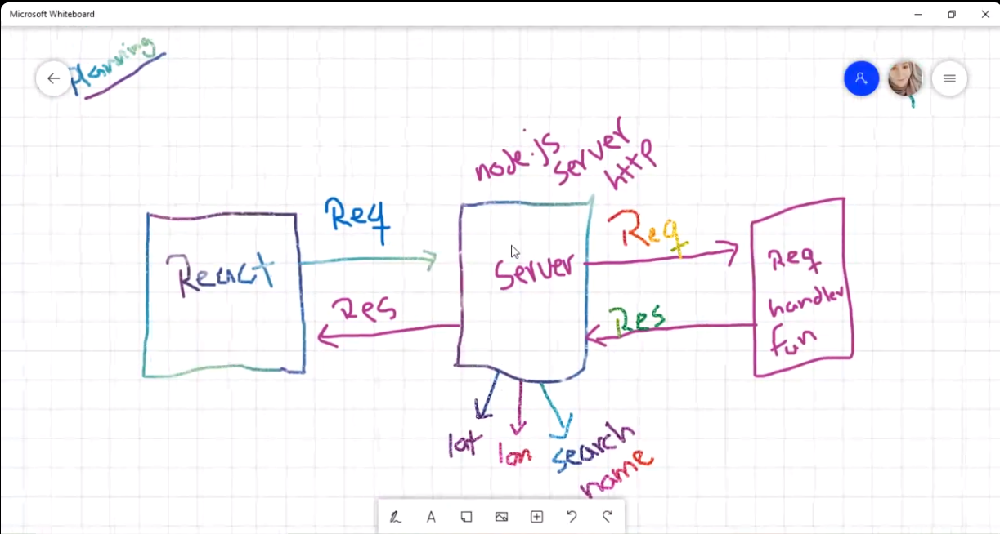

# city-explorer-api1

work with servers

## Server

**Author**: Tahany Ali

**Version**: 1.0.0 (increment the patch/fix version number if you make more commits past your first submission)

## Overview

<!-- Provide a high level overview of what this application is and why you are building it, beyond the fact that it's an assignment for this class. (i.e. What's your problem domain?) -->

## Getting Started
<!-- What are the steps that a user must take in order to build this app on their own machine and get it running? -->

## Architecture
<!-- Provide a detailed description of the application design. What technologies (languages, libraries, etc) you're using, and any other relevant design information. -->

## Change Log

<!-- Use this area to document the iterative changes made to your application as each feature is successfully implemented. Use time stamps. Here's an example:

01-01-2001 4:59pm - Application now has a fully-functional express server, with a GET route for the location resource. -->

## Credit and Collaborations
<!-- Give credit (and a link) to other people or resources that helped you build this application. -->
Name of feature: Set up your server repository.

Estimate of time needed to complete: 30 mintues

Start time: 2 pm

Finish time: 3 pm

Actual time needed to complete: 1 hour

Name of feature:  Weather (placeholder): As a user of City Explorer, I want to see weather info for the city I searched, so that I know how to pack for an upcoming trip.

Estimate of time needed to complete: 2 hours

Start time: 3 pm

Finish time: 7 pm

Actual time needed to complete: 4 hours

Name of feature:  3. Errors (revisited): As a user, I want clear messages if something goes wrong so I know if I need to make any changes or try again in a different manner.

Estimate of time needed to complete: 1 hours

Start time: 8 pm

Finish time: 10 pm

Actual time needed to complete: 2 hours
